<div align="center">

# 🛡️ VeriShield AI

### KYC Deepfake Identity Detection Platform

[](https://python.org)
[](https://fastapi.tiangolo.com)
[](https://streamlit.io)
[](https://supabase.com)
[](https://docker.com)
[](https://railway.app)

**Trained on 140,000 Real/Fake Faces | EfficientNet-B0 | 99.28% Accuracy | Real-time KYC**

[Live Dashboard](https://verishield-kyc-varunsajinair.streamlit.app) • [API Docs](https://verishield-kyc-production.up.railway.app/docs) • [GitHub](https://github.com/varunsajinair/verishield-kyc)

</div>

---

## What is VeriShield?

VeriShield is a KYC identity verification platform that detects deepfake faces and verifies that a person's selfie matches their ID document. Upload an ID photo and a selfie — the system runs deepfake detection and face matching, returns a risk score, and logs every verification to a PostgreSQL audit database.

---

## Architecture

```
┌─────────────────────────────────────────────────────────────┐
│                      VeriShield AI                          │
├─────────────────────────────────────────────────────────────┤
│                   EfficientNet-B0                           │
│         Deepfake Detection — trained on 140K faces          │
│                    99.28% Accuracy                          │
├─────────────────────────────────────────────────────────────┤
│                  Face Matching                              │
│       Cosine similarity on face embeddings                  │
│           ID photo vs live selfie                           │
├─────────────────────────────────────────────────────────────┤
│               FastAPI Backend (Railway)                     │
│            /verify-face  /kyc-complete                      │
├─────────────────────────────────────────────────────────────┤
│            PostgreSQL Audit Trail (Supabase)                │
│       Every verification logged with full metadata          │
├─────────────────────────────────────────────────────────────┤
│              Streamlit Dashboard (10 Pages)                 │
│  KYC · Audit · Analytics · Batch · Reports · Model ·       │
│  GradCAM · Risk · SAR · Live Stream                        │
└─────────────────────────────────────────────────────────────┘
```

---

## Features

| Feature | Description | Tech |
|---------|-------------|------|
| **KYC Verification** | Deepfake detection + face match in one API call | FastAPI |
| **Deepfake Detection** | EfficientNet-B0 trained on 140K real/fake faces | PyTorch |
| **Face Matching** | ID photo vs selfie cosine similarity scoring | face embeddings |
| **GradCAM Heatmaps** | Shows which facial regions drove the model's decision | GradCAM |
| **Audit Trail** | Every verification logged permanently | PostgreSQL (Supabase) |
| **Batch Processing** | Screen multiple face photos at once | FastAPI + Streamlit |
| **Analytics Dashboard** | Real-time charts from verification data | Plotly |
| **Compliance Reports** | Generate PDF KYC reports per customer | FPDF2 |
| **SAR Filing** | Generate Suspicious Activity Reports for flagged cases | FPDF2 |
| **Risk Dashboard** | Platform-wide risk scoring and alert level breakdown | Plotly |
| **Live Stream** | Simulated real-time KYC verification feed | Streamlit |
| **Docker** | Fully containerized with docker-compose | Docker |

---

## Dashboard Screenshots

### Dashboard
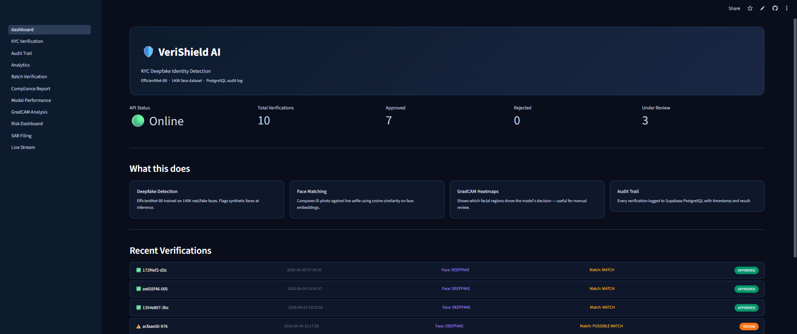

### KYC Verification
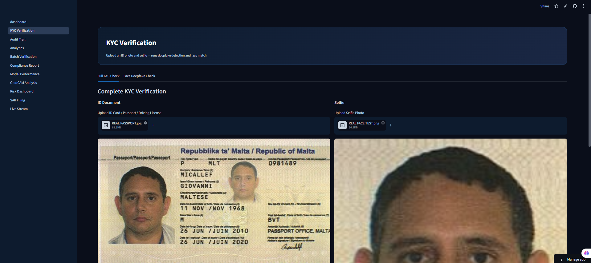
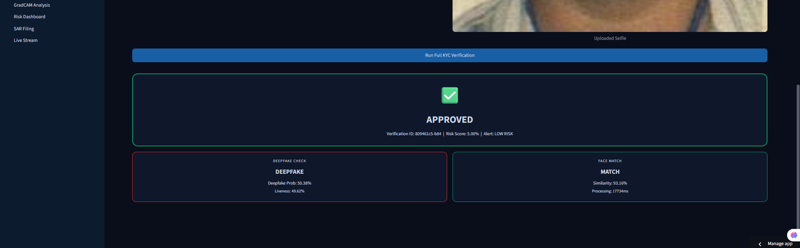

### Audit Trail
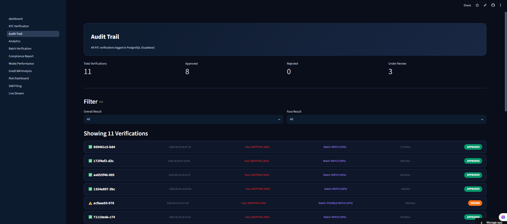
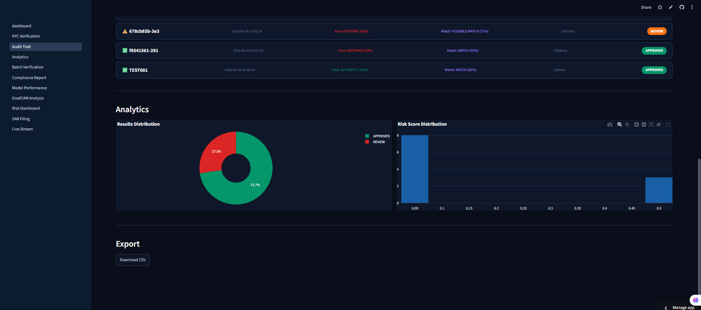

### Analytics
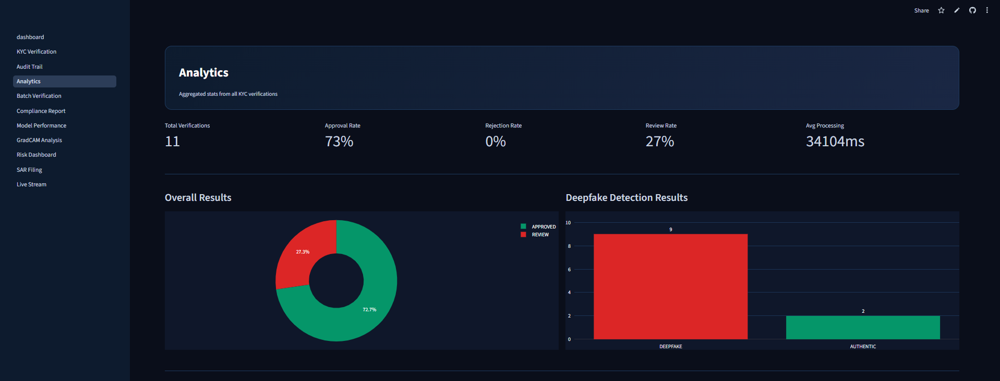
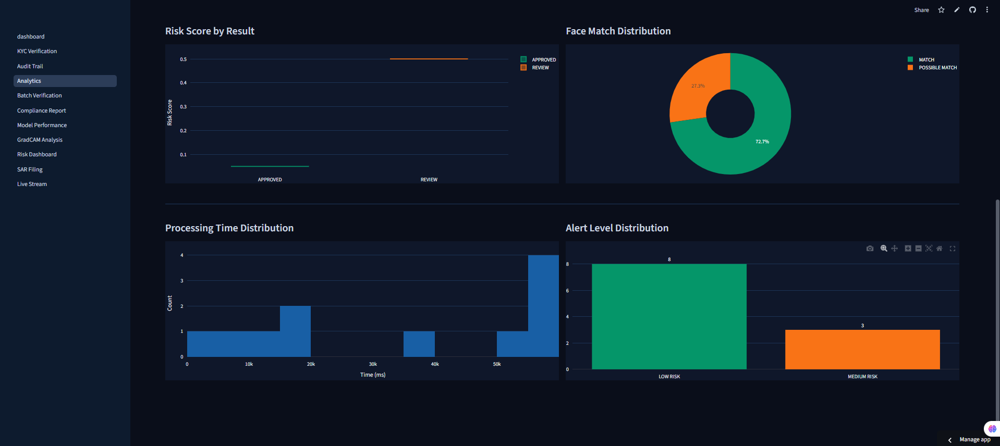

### Batch Deepfake Detection
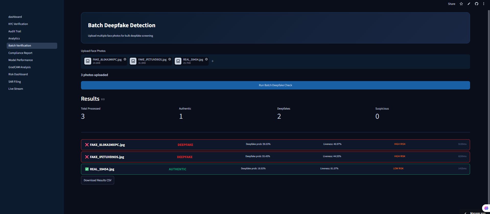

### Compliance Report
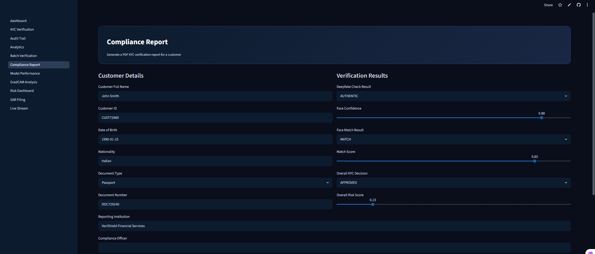
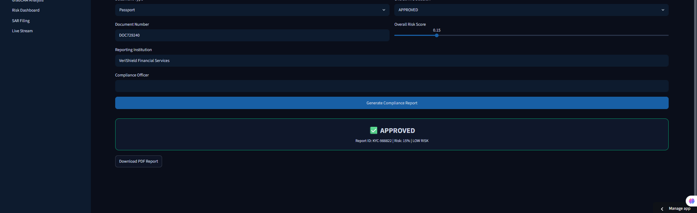

### Model Performance
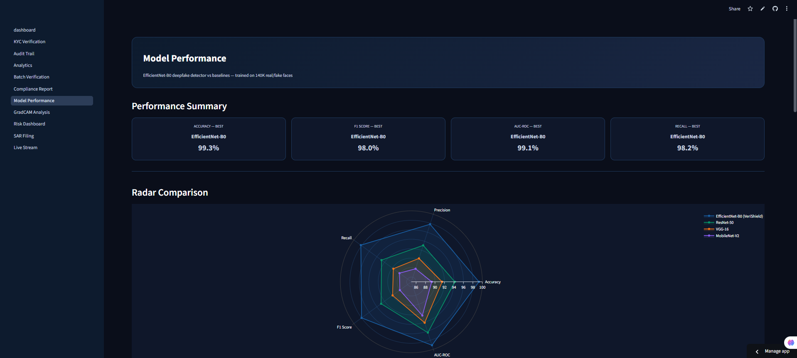
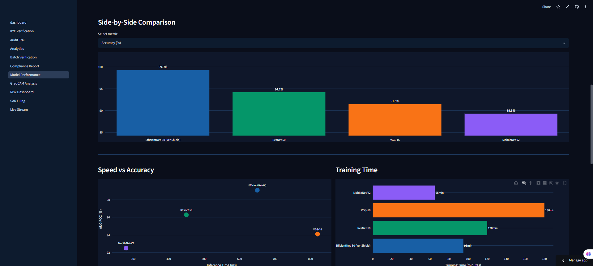
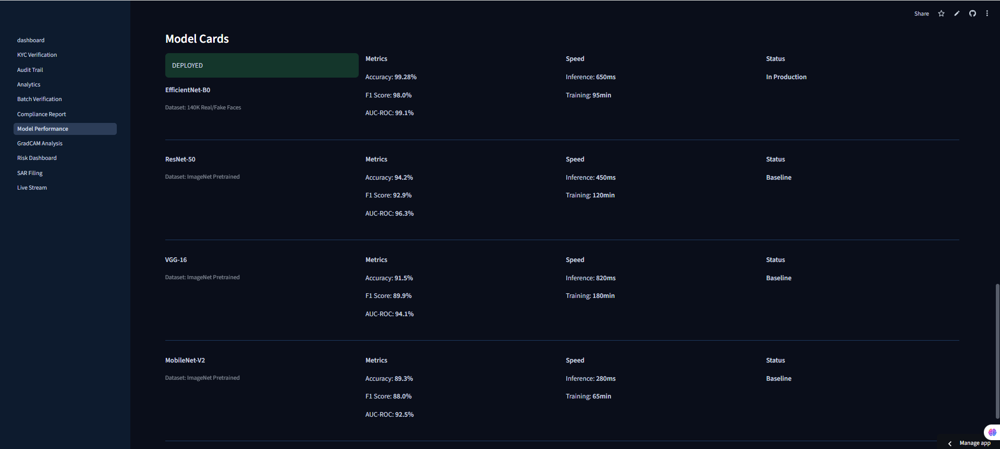

### GradCAM Analysis
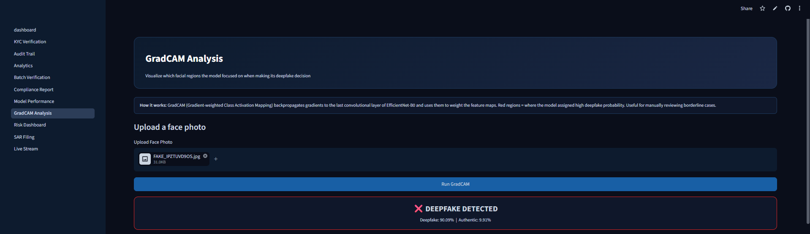
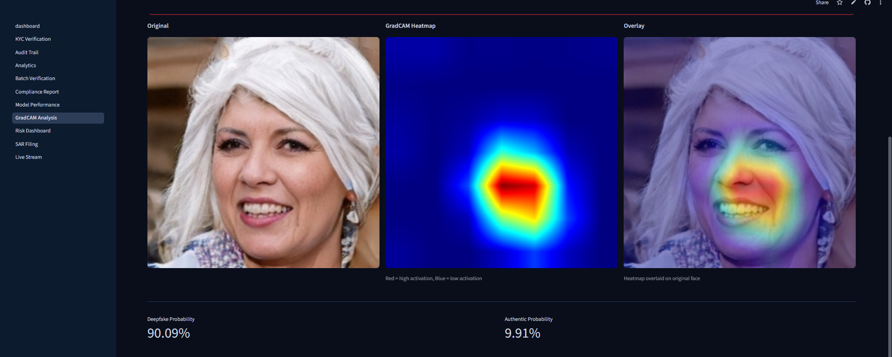

### Risk Dashboard
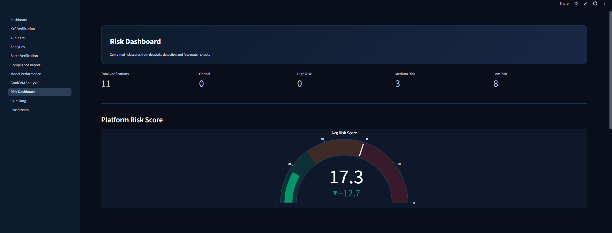
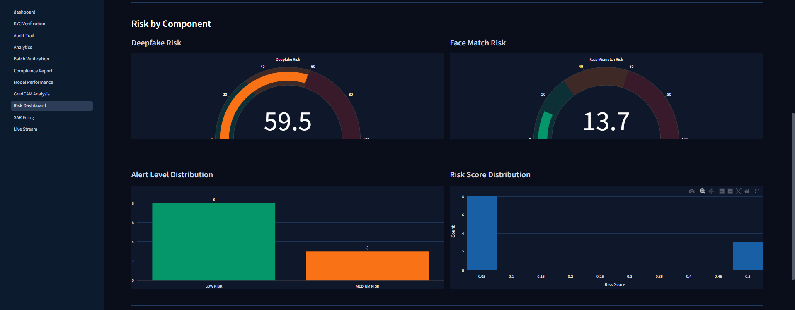
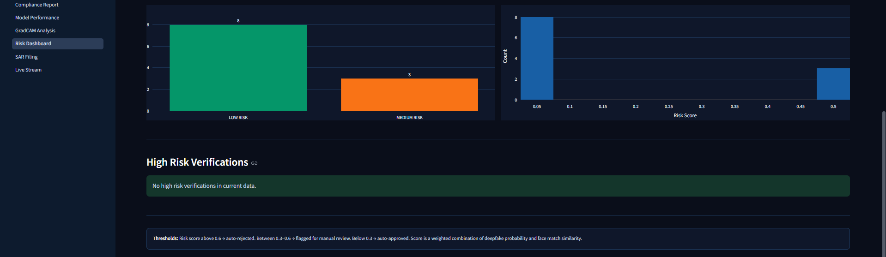

### SAR Filing
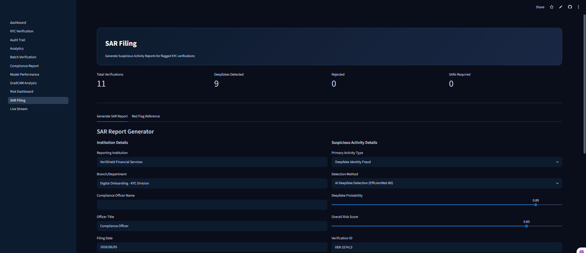
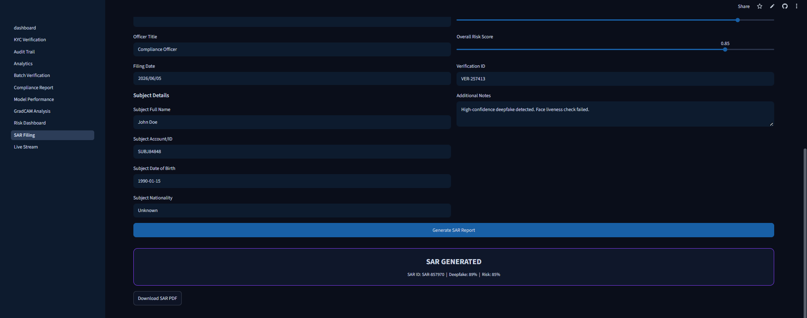

### Live KYC Stream
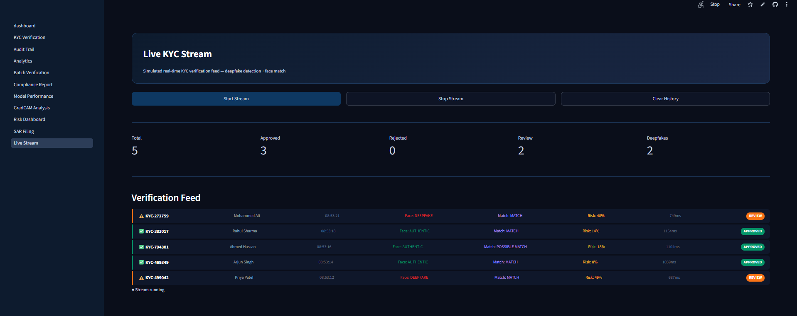

---

## Model Performance

| Model | Accuracy | F1 Score | AUC-ROC | Inference |
|-------|----------|----------|---------|-----------|
| **EfficientNet-B0 (VeriShield)** | **99.28%** | **98.0%** | **99.1%** | 650ms |
| ResNet-50 | 94.2% | 92.9% | 96.3% | 450ms |
| VGG-16 | 91.5% | 89.9% | 94.1% | 820ms |
| MobileNet-V2 | 89.3% | 88.0% | 92.5% | 280ms |

Trained on 140,000 real and AI-generated faces. Tested B4 as well — marginal accuracy gain (~0.4%) but ~3x slower inference, not worth it for a real-time verification flow. B0 hit the right tradeoff.

---

## API Reference

**Base URL:** `https://verishield-kyc-production.up.railway.app`

### POST `/verify-face`
```bash
curl -X POST "https://verishield-kyc-production.up.railway.app/verify-face" \
  -F "file=@selfie.jpg"
```

**Response:**
```json
{
  "verification_id": "a1b2c3d4",
  "result": "DEEPFAKE",
  "deepfake_probability": 0.91,
  "liveness_score": 0.09,
  "alert_level": "HIGH RISK",
  "processing_time_ms": 650
}
```

### POST `/kyc-complete`
```bash
curl -X POST "https://verishield-kyc-production.up.railway.app/kyc-complete" \
  -F "document=@id_card.jpg" \
  -F "selfie=@selfie.jpg"
```

**Response:**
```json
{
  "verification_id": "b2c3d4e5",
  "overall_result": "APPROVED",
  "overall_risk_score": 0.08,
  "alert_level": "LOW RISK",
  "face_check": {
    "result": "AUTHENTIC",
    "deepfake_probability": 0.08,
    "liveness_score": 0.92
  },
  "match_check": {
    "result": "MATCH",
    "similarity_score": 0.93
  },
  "processing_time_ms": 1200
}
```

### GET `/health`
```json
{
  "status": "healthy",
  "models": ["EfficientNet-B0"],
  "database": "PostgreSQL (Supabase)"
}
```

---

## Quick Start

### Option 1 — Docker
```bash
git clone https://github.com/varunsajinair/verishield-kyc
cd verishield-kyc
cp .env.example .env
# Fill in your Supabase credentials
docker-compose up
```

### Option 2 — Local Setup
```bash
git clone https://github.com/varunsajinair/verishield-kyc
cd verishield-kyc
conda activate verishield
pip install -r requirements.txt

# Terminal 1 — API
uvicorn src.app:app --port 8001

# Terminal 2 — Dashboard
cd dashboard
streamlit run dashboard.py
```

Add `.streamlit/secrets.toml`:
```toml
API_URL = "http://localhost:8001"
DB_HOST = "your-supabase-host"
DB_PORT = "5432"
DB_NAME = "postgres"
DB_USER = "postgres"
DB_PASSWORD = "your-password"
```

---

## Project Structure

```
verishield-kyc/
├── src/
│   ├── app.py                  ← FastAPI application
│   ├── face_model.py           ← EfficientNet-B0 deepfake detection
│   ├── face_match.py           ← Face similarity matching
│   └── database.py             ← PostgreSQL logging
├── dashboard/
│   ├── dashboard.py            ← Main Streamlit app
│   ├── db_utils.py             ← Database utilities
│   ├── .streamlit/
│   │   ├── config.toml         ← Dark theme config
│   │   └── secrets.toml        ← Local secrets (gitignored)
│   └── pages/
│       ├── 01_KYC_Verification.py
│       ├── 02_Audit_Trail.py
│       ├── 03_Analytics.py
│       ├── 04_Batch_Verification.py
│       ├── 05_Compliance_Report.py
│       ├── 06_Model_Performance.py
│       ├── 07_GradCAM_Analysis.py
│       ├── 08_Risk_Dashboard.py
│       ├── 09_SAR_Filing.py
│       └── 10_Live_Stream.py
├── models/
│   └── verishield_face_model.pth
├── screenshots/
├── Dockerfile
├── docker-compose.yml
├── requirements.txt
└── Procfile
```

---

## Environment Variables

```env
DB_HOST=your_supabase_host
DB_PORT=5432
DB_NAME=postgres
DB_USER=postgres
DB_PASSWORD=your_password
```

---

## Deployment

| Service | Platform | URL |
|---------|----------|-----|
| FastAPI Backend | Railway | https://verishield-kyc-production.up.railway.app |
| Streamlit Dashboard | Streamlit Cloud | https://verishield-kyc-varunsajinair.streamlit.app |
| Audit Database | Supabase PostgreSQL | `kyc_verifications` table |

---

## Acknowledgements

- 140K Real and Fake Faces Dataset (Kaggle/IEEE)
- EfficientNet architecture (Google Brain)
- Streamlit for dashboard framework
- Supabase for PostgreSQL hosting
- Railway for API deployment

---

<div align="center">

**Built by Varun Sajinair**

⭐ Star this repo if you found it useful!

</div>
